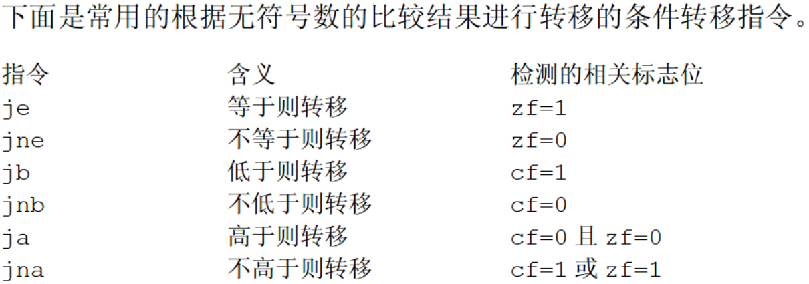

## **标志寄存器**
### 结构分布
15|14|13|12|11|10|9|8|7|6|5|4|3|2|1|0
|:-:|:-:|:-:|:-:|:-:|:-:|:-:|:-:|:-:|:-:|:-:|:-:|:-:|:-:|:-:|:-:|
|||||OF|DF|IF|TF|SF|ZF||AF||PF||CF|
#### **神奇的cmp**
- **无符号数**
    .png)
- **有符号数**
    .png)
#### **检测比较结果的条件转移指令**
- **无符号数**
    
    
- **有符号数**
---
`shl` `shr`
